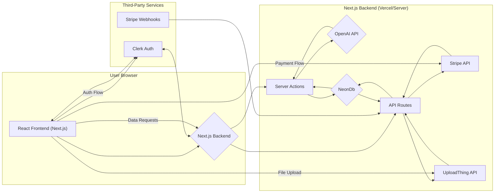

# SpeakEasyAI System Architecture

This document outlines the architecture of the SpeakEasyAI application, including its components, data flow, and design decisions.

## 1. System Architecture Overview

SpeakEasyAI is a full-stack web application built using Next.js 14 with the App Router. It follows a client-server model where the Next.js application serves both the frontend UI (React Server Components & Client Components) and the backend logic (API Routes, Server Actions). It integrates heavily with third-party services for core functionalities like authentication, payments, file storage, database, and AI processing.



**Key Interactions:**

- **Frontend (A):** User interface built with React, ShadCN UI, and Tailwind CSS. Interacts with the backend via Server Actions and API calls. Handles client-side logic like form validation and state management.
- **Backend (B):** Hosted on a platform like Vercel. Handles routing, data fetching, API logic, and server-side rendering.
- **Server Actions (C):** Functions executed on the server, often triggered by form submissions from the client. Used for mutations like processing uploads, generating AI content, and updating posts in the NeonDb (F). Interacts with OpenAI (E).
- **API Routes (D):** Traditional server endpoints used for specific tasks like handling Stripe Webhooks (J) and routing UploadThing requests (H). Can also interact with NeonDb (F) and Stripe (G).
- **Clerk (I):** Manages user authentication, session management, and provides UI components for sign-in/up. Protects routes via middleware.
- **NeonDb (F):** Serverless Postgres database storing user data, post content, and subscription status.
- **OpenAI API (E):** Provides Whisper for audio transcription and GPT models for blog post generation. Accessed via Server Actions.
- **UploadThing (H):** Handles file uploads, storage, and provides URLs for accessing uploaded files. Integrated via API Route and client-side hook (`useUploadThing`).
- **Stripe (G, J):** Manages payment processing for subscriptions via Stripe Checkout. Webhooks (J) notify the backend API Route (D) about payment events (completion, cancellation).

## 2. Project Folder Structure

The project follows the standard Next.js App Router structure:

```
awesome-kartikey-speakeasyai/
├── actions/                 # Server Actions (e.g., edit-actions.ts, upload-actions.ts)
├── app/                     # Next.js application core
│   ├── (logged-in)/         # Route group for authenticated users
│   │   ├── dashboard/       # User dashboard page
│   │   ├── posts/           # List/Edit post pages
│   │   ├── sign-in/         # Clerk sign-in page
│   │   └── sign-up/         # Clerk sign-up page
│   ├── api/                 # API Routes
│   │   ├── payments/        # Stripe webhook handler
│   │   └── uploadthing/     # UploadThing endpoint handlers
│   ├── globals.css          # Global CSS styles
│   ├── layout.tsx           # Root layout component
│   └── page.tsx             # Home page component
├── components/              # Reusable UI components
│   ├── common/              # General purpose components (e.g., BgGradient)
│   ├── content/             # Components related to content editing (MDXEditor)
│   ├── home/                # Components specific to the homepage
│   ├── ui/                  # ShadCN UI components (Button, Input, Toast, etc.)
│   └── upload/              # Components related to file upload flow
├── hooks/                   # Custom React hooks (e.g., use-toast.ts)
├── lib/                     # Libraries, utilities, helpers, constants
│   ├── constants.ts         # Application constants (plans, URLs)
│   ├── db.ts                # NeonDb connection setup
│   ├── payment-helpers.ts   # Stripe-related logic
│   ├── user-helpers.ts      # User/plan related logic
│   └── utils.ts             # General utilities (e.g., cn for classnames)
├── public/                  # Static assets (images, icons)
├── utils/                   # Specific utility integrations (e.g., UploadThing helpers)
├── middleware.ts            # Next.js middleware (Clerk authentication check)
├── next.config.mjs          # Next.js configuration
├── tailwind.config.ts       # Tailwind CSS configuration
├── tsconfig.json            # TypeScript configuration
├── package.json             # Project dependencies and scripts
└── .env.example             # Environment variable template
```

## 3. Major Components

- **Next.js App Router:** Manages routing, server/client component rendering, layouts, and integrates Server Actions.
- **Clerk:** Provides authentication components (`<SignIn>`, `<SignUp>`, `<UserButton>`), server-side helpers (`currentUser`), and middleware (`clerkMiddleware`) for protecting routes.
- **UploadThing:** Client hook (`useUploadThing`) initiates uploads, API route (`app/api/uploadthing`) handles requests, core logic (`core.ts`) defines permissions and post-upload actions.
- **OpenAI SDK:** Used within Server Actions (`actions/upload-actions.ts`) to interact with Whisper (transcription) and Chat Completions (blog generation) APIs.
- **NeonDb Client (`@neondatabase/serverless`):** Used in `lib/db.ts` and throughout Server Actions/API routes to query the Postgres database.
- **Stripe SDK:** Used in API routes (`app/api/payments/route.ts`) and helpers (`lib/payment-helpers.ts`) to handle webhook events and interact with the Stripe API.
- **Server Actions:** Located in `actions/`. Handle core business logic like processing uploads (`transcribeUploadedFile`, `generateBlogPostAction`) and updating posts (`updatePostAction`). Directly callable from client components.
- **ShadCN UI / `components/ui`:** Collection of reusable, styled components built on Tailwind CSS and Radix UI, providing the building blocks for the user interface.
- **MDXEditor (`@mdxeditor/editor`):** Used in `components/content/` to provide a rich text editing experience for Markdown content.

## 4. Data Flow Examples

**a) File Upload and Blog Generation:**

1.  **Trigger:** User selects a file and submits the form in `UploadForm` (`components/upload/upload-form.tsx`).
2.  **Client:** `useUploadThing` hook initiates the upload process.
3.  **UploadThing:**
    - Request hits `app/api/uploadthing/route.ts`.
    - Middleware (`core.ts`) verifies user authentication via Clerk (`currentUser`).
    - File is uploaded to UploadThing's storage.
    - `onUploadComplete` runs on the server, logging completion and returning file details.
4.  **Client Callback:** `onClientUploadComplete` (or response from `startUpload`) receives file details.
5.  **Server Action (Transcription):** Client triggers `transcribeUploadedFile` (`actions/upload-actions.ts`) with file details.
6.  **OpenAI (Whisper):** Action fetches the file from the URL and sends it to the Whisper API for transcription.
7.  **Server Action (Generation):** If transcription is successful, client state updates, and potentially triggers `generateBlogPostAction`.
8.  **Database (Read):** Action fetches the user's previous posts from NeonDb (`getUserBlogPosts`) for context.
9.  **OpenAI (GPT):** Action sends the transcription and user history to the GPT-4o-mini API with a specific prompt.
10. **Database (Write):** Action saves the generated title and content to the `posts` table in NeonDb (`saveBlogPost`).
11. **Navigation:** Action uses `revalidatePath` and `redirect` to navigate the user to the newly created post's edit page (`/posts/[id]`).

**b) User Authentication:**

1.  **Trigger:** User navigates to `/sign-in` or `/sign-up`.
2.  **Clerk:** Clerk's components (`<SignIn>`, `<SignUp>`) handle the UI and interact with Clerk's backend.
3.  **Session:** Upon successful authentication, Clerk manages the user session via cookies/tokens.
4.  **Middleware:** On subsequent requests to protected routes (e.g., `/dashboard`, `/posts`), `middleware.ts` uses `clerkMiddleware` to check the session. Unauthorized users are redirected to sign-in.
5.  **Server-Side Access:** Server Components and Server Actions can securely access user data using `currentUser()` from Clerk.

**c) Stripe Subscription:**

1.  **Trigger:** User clicks a "Get SpeakEasy" button linked to a Stripe `paymentLink` (`components/home/pricing.tsx`).
2.  **Stripe Checkout:** User is redirected to Stripe's hosted checkout page.
3.  **Payment:** User completes the payment on Stripe.
4.  **Stripe Webhook:** Stripe sends an event (`checkout.session.completed` or `customer.subscription.deleted`, etc.) to the configured webhook endpoint (`app/api/payments/route.ts`).
5.  **Webhook Handler:**
    - Verifies the incoming request signature using `stripe.webhooks.constructEvent`.
    - Retrieves relevant data (e.g., customer email, price ID) from the event or via Stripe API calls (`handleCheckoutSessionCompleted`, `handleSubscriptionDeleted` in `lib/payment-helpers.ts`).
    - Updates the user's record (e.g., `price_id`, `status`) in the NeonDb database.
6.  **Application State:** User's access level is updated based on their database record, granting access to features based on their plan.

## 5. Design Decisions

- **Next.js App Router & Server Actions:** Chosen for performance benefits (Server Components), improved developer experience (layouts, file-based routing), and the ability to co-locate server-side logic (Server Actions) reducing the need for separate API layers for simple mutations.
- **Clerk for Authentication:** Selected for its ease of integration, comprehensive feature set (multi-factor, social logins, passkeys, organization support), and robust security, offloading complex auth logic.
- **UploadThing for File Uploads:** Provides a simple, integrated solution specifically designed for modern frameworks like Next.js, handling complexities of file uploads and storage.
- **NeonDb for Database:** A serverless Postgres provider that integrates well with serverless platforms like Vercel, offering scalability, ease of use, and a generous free tier.
- **OpenAI for AI:** Leverages powerful, state-of-the-art models (Whisper for transcription, GPT for generation) via their well-documented APIs.
- **Stripe for Payments:** Industry standard for payment processing, providing secure checkout, subscription management, and reliable webhook system.
- **ShadCN UI & Tailwind CSS:** Utility-first CSS (Tailwind) allows for rapid styling, while ShadCN UI provides accessible, unstyled, composable components that can be easily customized, promoting consistency and reducing boilerplate UI code.
- **TypeScript:** Enhances code quality, maintainability, and developer productivity through static typing.
- **Webhook-Driven Updates (Stripe):** Ensures reliable synchronization of subscription status between Stripe and the application database, even if the user closes their browser after payment.

```

```

